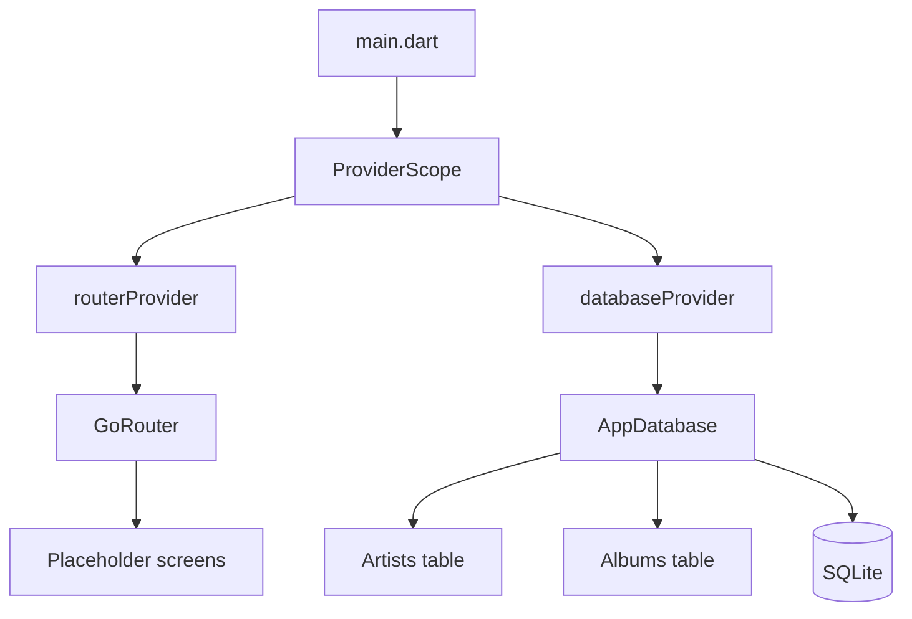
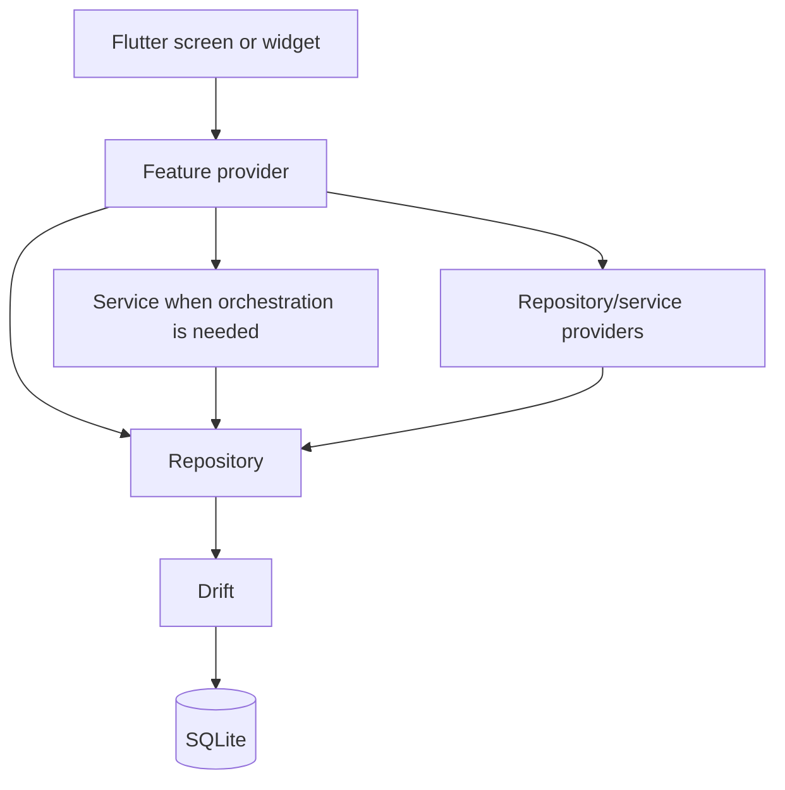

# Vinyl App 🎵

[](https://github.com/hunter-goller/vinyl-app/actions/workflows/ci.yml)


Vinyl App is a local-first Flutter application for vinyl collectors. It is
being designed to combine collection management, listening history, personal
analytics, music discovery, and NFC-assisted play logging in one experience.

Most collection tools focus on **what you own**. Vinyl App is intended to also
show **how your records fit into your life**: what you return to, what you have
forgotten, how your listening changes over time, and which records matter most
to you.

> **Project status:** Pre-alpha. The application foundation and the Artists and
> Albums tables are implemented on `main`. All user-facing screens are still
> placeholders. VinylApp-018 contains an unmerged Collection UI prototype that
> uses fake data and local state; it is not part of the current application.

## Current progress

| Area | Status |
| --- | --- |
| Flutter project and repository structure | Complete |
| Strict analysis and formatting rules | Complete |
| GitHub Actions CI | Complete |
| GoRouter navigation | Complete |
| Riverpod foundation | Complete |
| Drift/SQLite connection | Complete |
| Artists table | Complete |
| Albums table and artist foreign key | Complete |
| Plays table | Next — VinylApp-011 |
| Explicit migration workflow | Planned — VinylApp-012 |
| Repository layer | Planned — VinylApp-013 through 016 |
| Feature-level collection providers | Planned — VinylApp-043 |
| Theme and design tokens | Deferred — VinylApp-008 |
| Collection screen | On hold — VinylApp-018 |
| Shared Collection widgets | Unmerged prototype work; not present on `main` |

See the [implementation status](docs/implementation-status.md) and
[roadmap](ROADMAP.md) for the exact source-of-truth and dependency order.

## Product vision

### Collection management

- Add, edit, search, filter, and remove records.
- Store release, label, artwork, purchase, and condition information.
- Open detailed album pages from the collection.
- Optionally enrich records through a future Discogs integration.

### Listening history

- Log a full album, Side A, or Side B.
- Browse play history by album and across the full collection.
- Use NFC tags as a fast path for logging a record.

### Statistics and discovery

- Track most-played albums, artists, genres, and listening periods.
- Surface records that have not been played recently.
- Generate recommendations from collection metadata and listening history.

### Album Wrapped

Album Wrapped is the planned signature feature. Each record will have a
personal listening story containing insights such as first and latest play,
total plays, streaks, time-of-day or seasonal patterns, side preference,
collection ranking, rediscovery moments, and related recommendations.

## Technology stack

| Concern | Technology |
| --- | --- |
| Application framework | Flutter and Dart |
| Navigation | `go_router` |
| State and dependency management | Riverpod with code generation |
| Local persistence | Drift over SQLite |
| Code generation | `build_runner`, Riverpod Generator, Drift Dev |
| Quality checks | Flutter analyzer, formatter, tests |
| Continuous integration | GitHub Actions |

The initial product target is Android. Flutter platform scaffolding is present
for other platforms, but those targets have not yet been validated as supported
Vinyl App releases.

## Architecture

### Current `main` branch



### Target feature flow



Only `routerProvider` and `databaseProvider` exist today. Repositories,
services, `albumsProvider`, and `collectionFiltersProvider` are planned and
must not be documented as implemented.

Read the [architecture overview](docs/architecture/overview.md).

## Repository layout

```text
vinyl-app/
├── .github/                 # CI workflow and pull-request template
├── docs/                    # Technical and contributor documentation
├── design/                  # Visual assets and future diagrams
├── lib/
│   ├── db/                  # Implemented Drift database and two tables
│   ├── features/            # Placeholder route-level screens
│   ├── providers/           # Empty scaffold; future shared providers
│   ├── repositories/        # Empty scaffold; future repositories
│   ├── routing/             # Route constants and GoRouter provider
│   ├── services/            # Empty scaffold; future business workflows
│   ├── theme/               # Empty scaffold; VinylApp-008 deferred
│   ├── utils/               # Empty scaffold
│   ├── widgets/             # Empty scaffold on main
│   └── main.dart            # ProviderScope and app composition root
├── test/                    # Database, routing, and application smoke tests
├── CHANGELOG.md
├── CONTRIBUTING.md
├── ROADMAP.md
└── README.md
```

The widgets created on the VinylApp-018 prototype branch are not present in this
layout because that branch was not merged.

## Routes

| Path | Current screen |
| --- | --- |
| `/` | Collection placeholder |
| `/stats` | Statistics placeholder |
| `/discover` | Discover placeholder |
| `/album/new` | Add Record placeholder |
| `/album/:id` | Album Detail placeholder with path parameter |
| `/play/log` | Log Play placeholder |

The routes resolve so navigation and path-parameter handling can be verified.
External Android App Links and iOS Universal Links are not configured.

## Local development

### Prerequisites

- Flutter on the stable channel
- A Dart SDK compatible with `^3.12.2`
- Android Studio or another supported Flutter development environment
- An Android emulator or physical device for the current primary target

### Setup

```bash
git clone https://github.com/hunter-goller/vinyl-app.git
cd vinyl-app
flutter pub get
dart run build_runner build --delete-conflicting-outputs
flutter analyze
flutter test
flutter run
```

Generated `*.g.dart` files are intentionally ignored. Regenerate them whenever a
Drift schema or annotated Riverpod provider changes.

See the [development setup guide](docs/development/setup.md).

## Continuous integration

Every pull request targeting `main`, every push to `main`, and manual workflow
runs execute:

1. Dependency installation
2. Drift and Riverpod code generation
3. Formatting verification
4. Static analysis
5. Automated tests
6. Debug APK build verification

See [CI documentation](docs/architecture/ci-cd.md).

## Documentation

Start with the [documentation index](docs/README.md).

- [Current implementation status](docs/implementation-status.md)
- [Architecture overview](docs/architecture/overview.md)
- [Project structure](docs/architecture/project-structure.md)
- [Database](docs/architecture/database.md)
- [Routing](docs/architecture/routing.md)
- [State management](docs/architecture/state-management.md)
- [Testing](docs/development/testing.md)
- [Architecture decisions](docs/decisions/README.md)
- [Feature specifications](docs/features/README.md)
- [Roadmap](ROADMAP.md)
- [Changelog](CHANGELOG.md)

## Contributing

The project is currently maintained as a personal portfolio application. Read
[CONTRIBUTING.md](CONTRIBUTING.md) before starting work.

## License

A public license has not yet been selected. Until a license is added, the source
is publicly viewable but no additional reuse rights are granted automatically.
