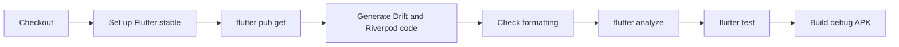

# Continuous Integration

GitHub Actions verifies every pull request into `main`, every push to `main`, and
manual workflow dispatches.

## Workflow

The workflow is defined in `.github/workflows/ci.yml` and runs on Ubuntu.



## Steps

### Checkout

Fetches the repository source.

### Flutter setup

Uses the stable Flutter channel with dependency caching enabled.

### Dependency installation

```bash
flutter pub get
```

### Code generation

```bash
dart run build_runner build --delete-conflicting-outputs
```

This step is mandatory because generated `*.g.dart` files are ignored by Git.
It catches incompatible annotations or schemas before analysis.

### Formatting

```bash
dart format --output=none --set-exit-if-changed .
```

The pipeline fails when committed Dart code is not formatted.

### Analysis

```bash
flutter analyze
```

The repository uses strict casts, inference, and raw-type checking in addition
to project lint rules.

### Tests

```bash
flutter test
```

Runs database, routing, and widget tests.

### Build verification

```bash
flutter build apk --debug
```

Confirms the Android application compiles after code generation and tests.

## Branch protection

The project intends `main` to require the CI check before merge. Repository
settings enforce that policy; the workflow file itself cannot guarantee branch
protection.

## Documentation deployment later

GitHub Pages should eventually use a separate deployment workflow triggered by
changes merged into `main`. Generated Pages output may be written to a
`gh-pages` branch or deployed through GitHub's Pages artifact mechanism. Source
documentation remains in `main`; no permanent hand-edited docs branch is needed.
