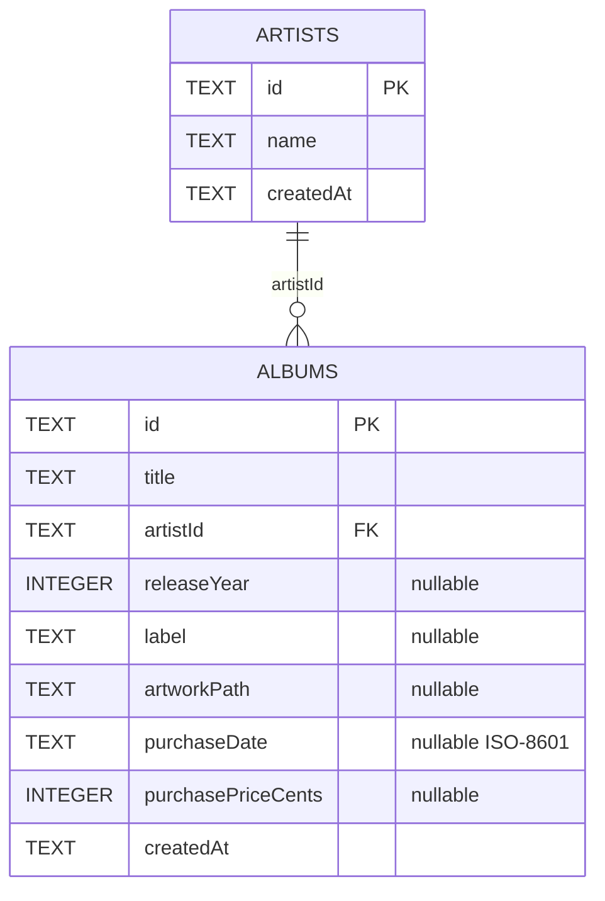

# Database Architecture

Vinyl App uses Drift as a type-safe Dart layer over a local SQLite database.
SQLite is intended to remain the source of truth for core collection and
listening data.

## Connection lifecycle

`AppDatabase` accepts an optional `QueryExecutor`:

```dart
AppDatabase([QueryExecutor? executor])
```

- Production uses a lazy file-backed connection.
- Tests inject `NativeDatabase.memory()`.

The production database file is opened in the application documents directory:

```text
vinyl_app_db.sqlite
```

`NativeDatabase.createInBackground` keeps database work off the main isolate.

## Riverpod ownership

`databaseProvider` is marked `keepAlive: true` and closes the connection when its
owning provider container is disposed. `main.dart` watches it at startup to make
the connection eager.

## Current schema



### Artists

Defined in `lib/db/schema/artists.dart`.

| Column | Drift type | Required | Notes |
| --- | --- | --- | --- |
| `id` | Text | Yes | Primary key |
| `name` | Text | Yes | Artist display name |
| `createdAt` | Text | Yes | ISO-8601 timestamp by current convention |

The table generates an `Artist` row type and `ArtistsCompanion` write type.

### Albums

Defined in `lib/db/schema/albums.dart`.

| Column | Drift type | Required | Notes |
| --- | --- | --- | --- |
| `id` | Text | Yes | Primary key |
| `title` | Text | Yes | Album title |
| `artistId` | Text | Yes | Foreign key to `Artists.id` |
| `releaseYear` | Integer | No | Release year |
| `label` | Text | No | Record label |
| `artworkPath` | Text | No | Local artwork location |
| `purchaseDate` | Text | No | ISO-8601 date by current convention |
| `purchasePriceCents` | Integer | No | Currency stored as cents, not floating point |
| `createdAt` | Text | Yes | ISO-8601 timestamp by current convention |

The table generates an `Album` row type and `AlbumsCompanion` write type.

## Foreign-key enforcement

SQLite does not enforce foreign keys unless enabled on the connection. The
current `beforeOpen` migration hook runs:

```sql
PRAGMA foreign_keys = ON;
```

A table test verifies that an album cannot reference an artist that does not
exist.

## Next schema

The planned Plays table contains:

| Column | Type | Notes |
| --- | --- | --- |
| `id` | Text primary key | Unique play record |
| `albumId` | Text foreign key | References Albums |
| `playedAt` | Text | ISO-8601 timestamp |
| `sidePlayed` | Text | `full`, `sideA`, or `sideB` |
| `createdAt` | Text | Record creation timestamp |

This table will power play history, recently played, statistics, discovery, NFC
logging, and Album Wrapped.

## Migration status

`schemaVersion` is currently `1`. The current migration customization enables
foreign keys before opening. A dedicated task will add explicit schema snapshot,
creation, and step-up migration tests.

Until that work is complete:

- Do not increase `schemaVersion` casually.
- Treat table changes as development-only schema changes.
- Add migration documentation and tests before supporting installed user data.

## Generated types

Drift names row and companion classes differently when `@DataClassName` is
used:

| Table class | Row class | Companion class |
| --- | --- | --- |
| `Artists` | `Artist` | `ArtistsCompanion` |
| `Albums` | `Album` | `AlbumsCompanion` |

After schema changes, run:

```bash
dart run build_runner build --delete-conflicting-outputs
```

## Testing

Current database tests verify:

- A database can open and execute a query in memory.
- An artist can be inserted and selected.
- An album can be inserted with a valid artist.
- An album with an invalid artist ID fails.

See [testing documentation](../development/testing.md).
