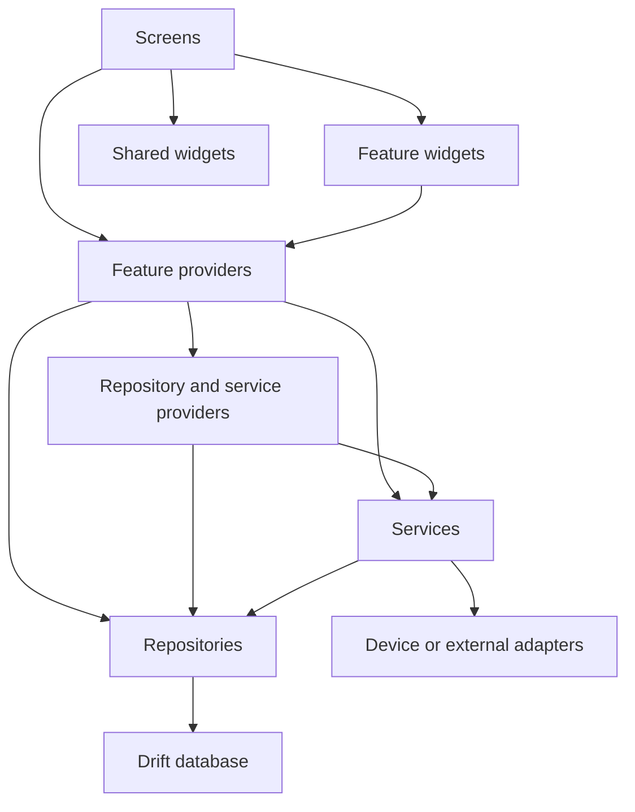
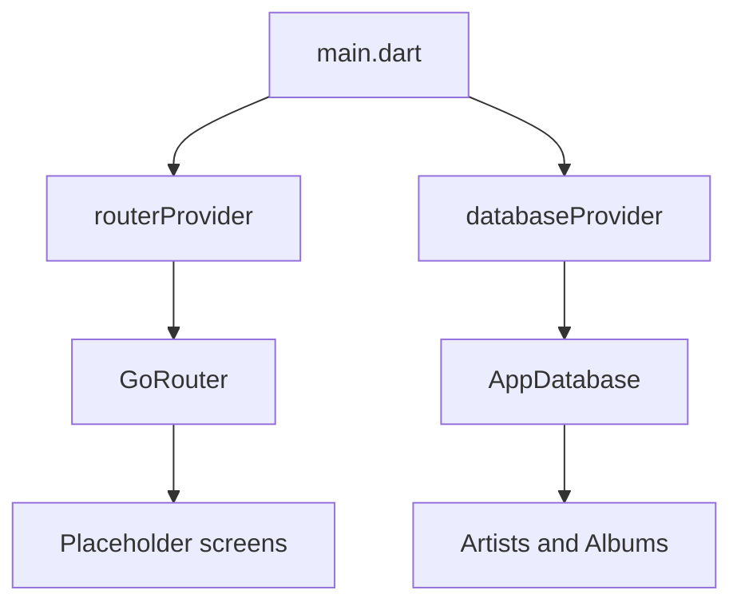
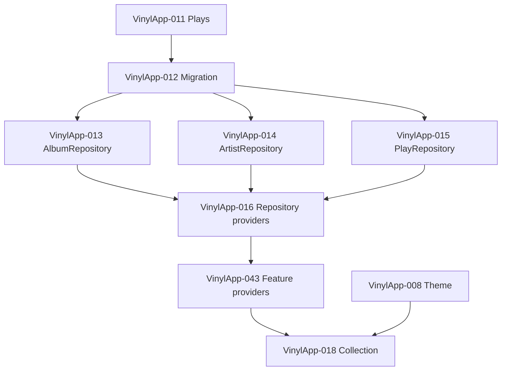

# Dependency Graph

## Allowed direction

## Rules

- Screens may depend on providers, routing, and widgets.
- Widgets expose data and callbacks; they do not construct repositories.
- Providers expose repositories, services, and asynchronous feature state.
- Services coordinate multi-step workflows.
- Repositories own Drift queries.
- Drift code must not import feature UI.
- Shared layers must not depend on one feature's presentation code.

## Current `main` graph

Repositories, services, and feature providers are not implemented today.

## Collection ticket dependency graph

VinylApp-017 is part of the core data-layer sequence and unlocks actual play
logging. VinylApp-043 is the direct task that provides the state named in
VinylApp-018.

## Prototype exception

The unmerged VinylApp-018 branch skips this graph by using fake data and local
state. That makes it a visual prototype, not the final Collection architecture.
