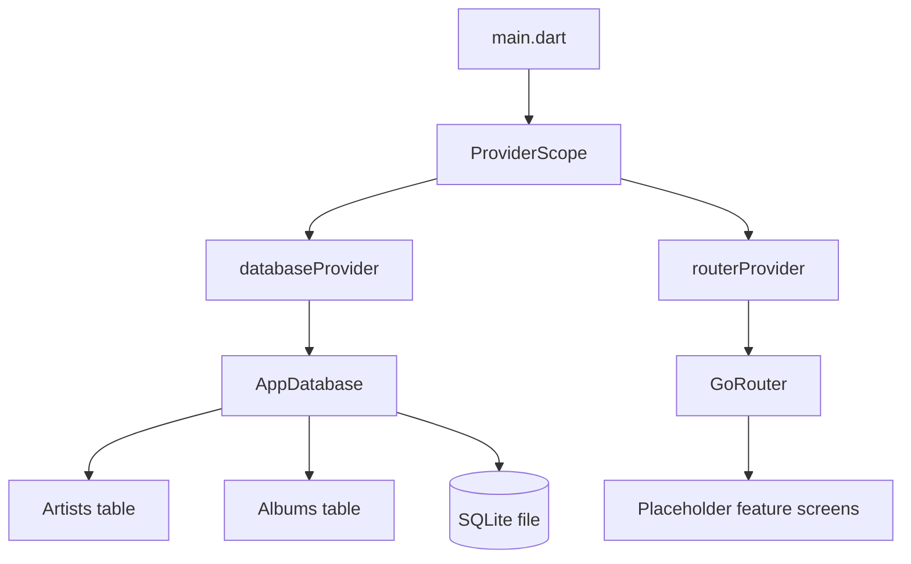
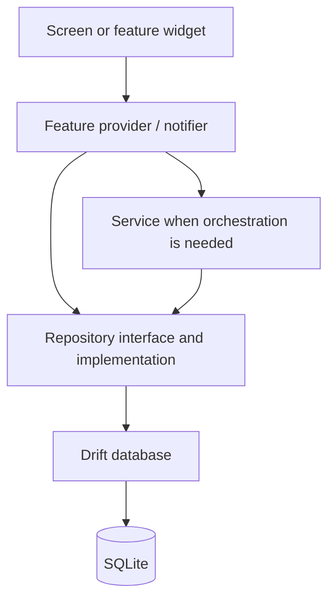

# Architecture Overview

## Purpose

Vinyl App is a local-first Flutter application. Its architecture is intended to
keep UI, state, business workflows, and persistence separate enough to test and
evolve independently without creating unnecessary abstractions before they are
needed.

## Current architecture

The current codebase contains an application composition root, Riverpod-provided
router and database, feature placeholder screens, and Drift tables for Artists
and Albums.

`main.dart` eagerly watches the database provider so the connection is opened at
application startup. It also watches the router provider and passes the router
to `MaterialApp.router`.

## Target architecture

As the data layer is completed, feature UI should no longer communicate with
Drift directly.

A provider may call a repository directly for a simple read or write. A service
is appropriate when one action coordinates several repositories, hardware APIs,
or domain rules. For example, `PlayLoggingService` is planned to create a play,
update album listening metadata, and handle NFC-originated logging without
placing that sequence in a widget.

## Layer responsibilities

### Presentation

Feature screens and widgets render state, capture user intent, and navigate.
They should not contain SQL or multi-step business workflows.

### Providers

Riverpod providers expose dependencies and feature state. Providers own
lifetimes, support dependency overrides in tests, and translate asynchronous
results into UI-consumable state.

### Services

Services coordinate business workflows that span multiple dependencies. The
folder is currently scaffolded but empty.

### Repositories

Repositories will define persistence operations in domain language, hiding
Drift queries from UI and services. The folder is currently scaffolded but
empty.

### Database

Drift owns table definitions, generated row/companion types, SQL execution, and
migrations. SQLite is the local source of truth.

## Architectural principles

1. **Local-first:** Core collection and play tracking must work without a
   network connection.
2. **Incremental structure:** Add abstractions when a real dependency or testing
   need exists; do not fill the repository with unused layers.
3. **Testable boundaries:** Dependencies are exposed through Riverpod and the
   database accepts an injected executor.
4. **Single source of route paths:** Navigation paths belong in `AppRoutes`.
5. **Generated code is disposable:** Riverpod and Drift generated files are
   regenerated, ignored by Git, and never edited manually.
6. **Documentation follows implementation:** Planned features are explicitly
   labeled as planned instead of being described as complete.

## Related documents

- [Dependency graph](dependency-graph.md)
- [Project structure](project-structure.md)
- [State management](state-management.md)
- [Database](database.md)
- [Repository pattern](repository-pattern.md)
- [Services](services.md)
