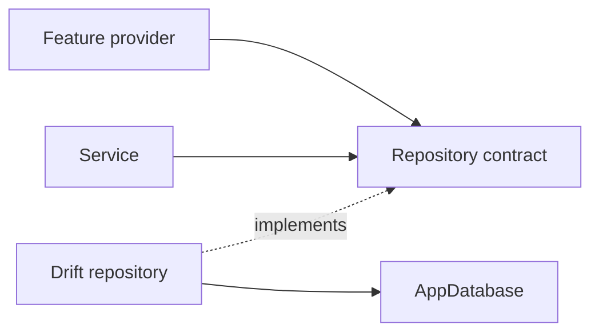

# Repository Pattern

## Status

The repository layer is planned and `lib/repositories/` is currently empty.

## Purpose

Repositories keep Drift query details out of feature providers, services, and
widgets. They expose operations using application language rather than raw SQL
or generated table APIs.

## Trello tasks

### VinylApp-013 — AlbumRepository

Planned operations:

- `findAll()`
- `findById()`
- `create()`
- `update()`
- `delete()`
- `search(query)` by album title and artist name

### VinylApp-014 — ArtistRepository

Planned operations:

- `findOrCreate(name)` with case-insensitive deduplication
- `findById()`
- `findAll()`

### VinylApp-015 — PlayRepository

Planned operations:

- `create()`
- `findByAlbum(albumId)`
- `findAll()`
- `deleteById()`
- `getPlayCountByAlbum()`
- `getRecentlyPlayed(limit)`

### VinylApp-016 — Repository providers

Creates Riverpod providers for repositories. Although some earlier repository
card checklists mention creating their provider, VinylApp-016 is the dedicated
provider-layer task and should be treated as the shared source of truth.

## Rules

- Feature UI does not import Drift table classes once repositories exist.
- Repositories return domain-friendly results, not query builders.
- Repository implementations receive `AppDatabase` through dependency
  injection.
- Repository providers are overrideable in tests.
- Aggregation queries belong in repositories when they are fundamentally data
  access.
- Interpretation and orchestration belong in services.
- Methods receive focused tests against an in-memory database.

## Collection requirement

VinylApp-018 needs album data joined with artist information and play-derived
values. The screen should consume a provider-facing result rather than issue
joins or aggregation queries itself.
