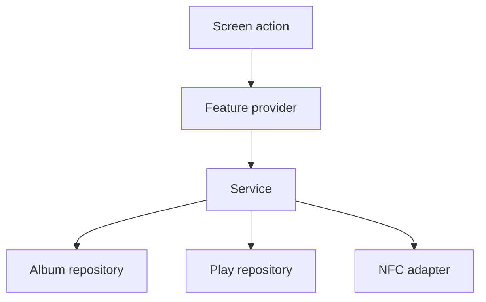

# Services

## Status

The service folder is scaffolded but empty. This document defines when a service
should be introduced.

## Purpose

A service coordinates a user action that spans multiple repositories, hardware
adapters, or domain rules. It should not render UI and should not own Flutter
widget state.

## Planned services

### PlayLoggingService

Expected responsibilities:

- Validate the target album.
- Create exactly one play record.
- Apply full/Side A/Side B information.
- Update or expose recently played state.
- Support a play initiated by an NFC scan.

### StatisticsService

May combine album and play repository results into higher-level metrics that do
not map cleanly to a single SQL query.

### RecommendationService

Will interpret collection metadata and listening history to produce explainable
recommendations and rediscovery suggestions.

### NfcService

Will wrap device capability checks, tag scanning/writing, album lookup, and hand
off to `PlayLoggingService`.

## When not to create a service

Do not add a service that merely forwards one repository call. A provider may
call a repository directly for a simple read or write. Services earn their place
when they centralize rules or coordination that would otherwise be duplicated.

## Testability

Services should receive repository or adapter dependencies through constructors
or providers. Tests should use fakes and verify outcomes without requiring a
Flutter widget tree or physical NFC hardware.
