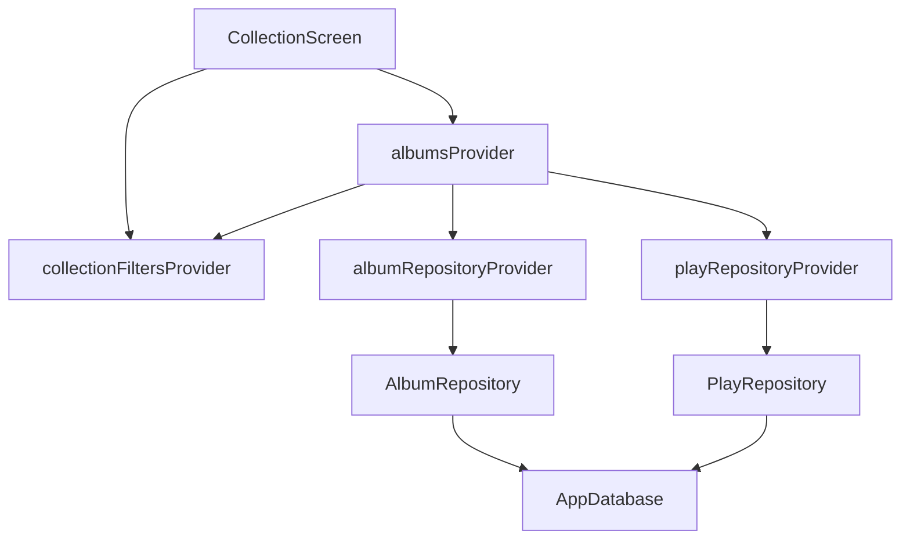

# State Management and Dependency Injection

Vinyl App uses Riverpod for state management and dependency injection.

## Root scope

`main()` wraps the app with `ProviderScope`:

```dart
runApp(const ProviderScope(child: MyApp()));
```

## Providers implemented today

### `routerProvider`

Generated from the annotated `router()` function. It owns the `GoRouter`
instance used by `MaterialApp.router`.

### `databaseProvider`

Generated from an annotated `database()` function with `keepAlive: true`.
The database is a process-wide dependency. It registers `db.close` through
`ref.onDispose`.

No repository, service, or feature providers are implemented on `main` yet.

## Planned repository providers — VinylApp-016

- `albumRepositoryProvider`
- `artistRepositoryProvider`
- `playRepositoryProvider`
- `nfcTagRepositoryProvider`

These providers expose repositories and must be overrideable in tests. UI and
feature providers should not read Drift directly.

## Planned feature providers — VinylApp-043

- `albumsProvider`
- `albumProvider(id)`
- `recentlyPlayedProvider`
- `playCountProvider(albumId)`
- `collectionFiltersProvider`

VinylApp-043 is the direct provider dependency identified by VinylApp-018.
Neither VinylApp-009 nor VinylApp-010 implemented these providers.

## Collection state flow



The exact implementation may evolve, but the screen must consume provider state
rather than `fakeAlbums` or local-only sorting.

## Provider lifetime guidance

- Use a normal generated provider for cheap, recreatable dependencies.
- Use `keepAlive: true` for resources that must persist for the application
  lifetime, such as the database connection.
- Prefer auto-disposal for screen-specific asynchronous state when leaving the
  screen should release it.
- Document providers whose lifetimes differ from the default.

## Test overrides

Providers should be overrideable through `ProviderContainer` or
`ProviderScope(overrides: ...)`.

```dart
final container = ProviderContainer(
  overrides: [routerProvider.overrideWithValue(testRouter)],
);
```

Future repository and service providers must preserve this capability.

## Rules

1. UI watches providers; it does not instantiate repositories.
2. Providers do not contain Flutter widget code.
3. Providers do not query Drift directly when a repository owns that data.
4. A provider may call a repository directly for simple operations.
5. Multi-step workflows belong in services.
6. Provider errors should be represented explicitly.
7. Dependencies should be overrideable for tests.
8. Generated provider files are not edited or committed.
