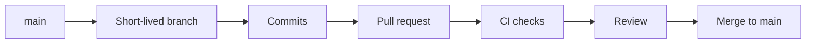

# Git Workflow

## Branch model

`main` is the integration branch. Work happens on short-lived branches and is
merged through pull requests after CI succeeds.



Do not keep a permanent development or documentation branch. The future GitHub
Pages deployment branch, if used, should contain generated output only.

## Starting a task

```bash
git switch main
git pull --ff-only
git switch -c VinylApp-011
```

## Before pushing

```bash
dart run build_runner build --delete-conflicting-outputs
dart format .
flutter analyze
flutter test
```

## Commit messages

Use imperative, durable descriptions:

```text
Add Plays Drift table
Add query-by-album play test
Document play schema
```

Avoid messages such as `updates`, `fix stuff`, or descriptions of the editing
process rather than the outcome.

## Pull-request titles

Align the title with the task and merged result:

```text
VinylApp-011: Add Plays Drift table
Docs: Document current database architecture
```

The repository is configured to use the pull-request title and description for
merge commits, so both should read well in long-term history.

## After merge

```bash
git switch main
git pull --ff-only
git branch -d VinylApp-011
```

Delete the remote feature branch through GitHub or with Git when it is no longer
needed.
