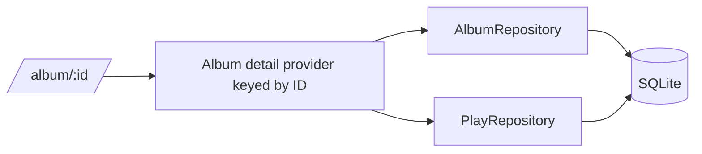

# Album Details

- Route: `/album/:id`
- Current status: Placeholder screen receives and displays the ID

## Purpose

Present one record's metadata, listening history, statistics, and personal
story.

## Intended content

- Artwork, title, artist, year, label, and collection metadata
- Total play count and latest play
- Play timeline and trends
- Side preference when available
- Edit, delete, and Log Play actions
- Album Wrapped insights
- Related or similar records

## Planned data flow

## States

- Loading
- Album found
- Album not found
- Database error
- Album with no plays
- Album with rich play history

Deletion must require confirmation and define what happens to related plays and
NFC associations before it is implemented.
