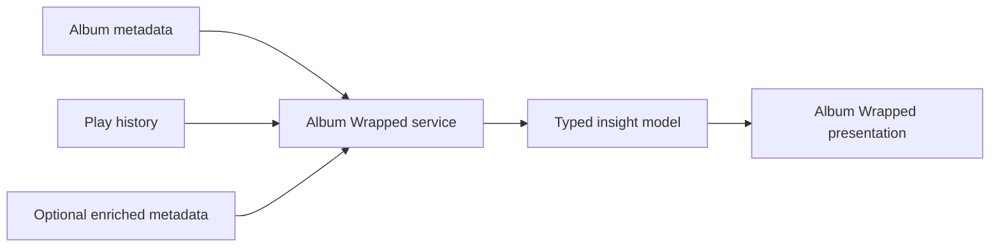

# Album Wrapped

- Current status: Planned signature feature

## Product question

**What does this record mean to me?**

Album Wrapped is intended to transform one album's metadata and play history
into a personal story rather than a generic statistics page.

## Planned insights

- First and latest play
- Total plays
- Longest listening streak
- Average time between plays
- Play trend over time
- Seasonal and time-of-day patterns
- Full album versus Side A / Side B preference
- Collection rank
- Milestones and rediscovery moments
- Similar records and next-listen suggestions
- Favorite tracks when track-level data eventually exists

## Data requirements

The initial version can derive most insights from Albums and Plays. Richer
insights may later require genre, track, and external metadata.

## Design principles

- Narrative before dashboards
- Celebrate small histories without fabricating significance
- Explain every insight in plain language
- Handle albums with zero or one play gracefully
- Preserve privacy by calculating locally whenever practical
- Keep the experience shareable only through an explicit user action

## Architecture direction

