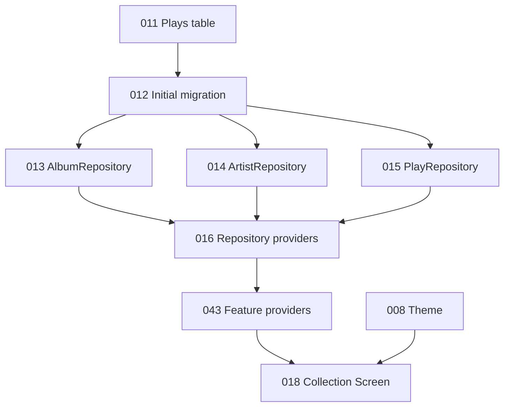

# Current Implementation Status

This page is the source-of-truth summary for what exists on the current `main`
branch.

## Implemented on `main`

### Foundation

- VinylApp-001 — Flutter project and folder scaffold
- VinylApp-002 — analyzer and lint configuration
- VinylApp-003 — GitHub repository workflow and pull-request template
- VinylApp-004 — GitHub Actions CI
- VinylApp-005 — GoRouter setup
- VinylApp-006 — Riverpod foundation
- VinylApp-007 — Drift and SQLite setup

### Database

- VinylApp-009 — Albums table
- VinylApp-010 — Artists table
- Foreign-key enforcement from `Albums.artistId` to `Artists.id`
- In-memory database and table tests

### Current providers

- `routerProvider`
- `databaseProvider`

### Current screens

The six routes resolve, but each user-facing screen is a placeholder:

- Collection
- Statistics
- Discover
- Add Record
- Album Detail
- Log Play

`RouteTestButtons` is temporary navigation scaffolding.

## Not implemented on `main`

- Theme and design tokens
- Plays table
- Explicit Drift migration files and schema snapshots
- AlbumRepository
- ArtistRepository
- PlayRepository
- Repository providers
- PlayLoggingService
- `albumsProvider`
- `collectionFiltersProvider`
- `albumProvider(id)`
- `recentlyPlayedProvider`
- `playCountProvider(albumId)`
- Real Collection UI
- Shared production widgets
- Real add, edit, detail, play, statistics, discovery, recommendation, or NFC
  flows

## VinylApp-018 branch

VinylApp-018 is on hold. An unmerged branch contains a visual prototype with:

- `fakeAlbums`
- local `_sortBy` state
- a delayed fake refresh
- hard-coded presentation colors
- early widget implementations

The branch includes prototypes named:

- `AlbumListTile`
- `BottomNavBar`
- `GenreChip`
- `SummaryBar`
- `EmptyState`
- `FilterChipRow`
- `PrimaryButton`
- `SectionHeader`

These files are not part of `main`, so they must not be marked complete in the
README, changelog, architecture diagrams, or feature status tables.

## Collection dependency chain

VinylApp-018's Trello description requires `albumsProvider` and
`collectionFiltersProvider`. Those providers belong to VinylApp-043, not
VinylApp-009 or VinylApp-010.

VinylApp-017 PlayLoggingService remains part of the ordered data-layer work and
is required for logging plays, but it is not the direct provider dependency for
rendering the Collection list.

## Completion rule for VinylApp-018

VinylApp-018 is complete only when the merged implementation:

1. reads real data through providers and repositories;
2. does not use `fakeAlbums`;
3. does not keep Collection filters solely in local widget state;
4. sorts by actual last-played information;
5. shows actual play counts;
6. handles loading, empty, error, and populated states;
7. refreshes real data;
8. navigates to `/album/:id`;
9. passes tests and CI.
